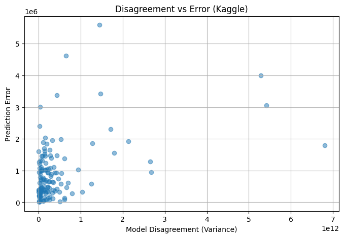

# Understanding Prediction Disagreement in Machine Learning Models

## Project Summary

This project investigates **prediction disagreement across machine learning models**—why different models trained on the same data can produce **significantly different predictions for the same input**, even when their overall accuracy metrics are similar.

Rather than focusing on finding a single “best” model, the goal is to:
- analyze **model behavior**
- understand **where and why disagreement occurs**
- study **decision-level reliability** in regression tasks

The primary use case explored is **house price prediction**.

A detailed intuition-driven explanation is provided in the accompanying blog.  
This README focuses on the **technical implementation and experimental setup**.

---

## Technologies Used

- **Programming Language:** Python 3  
- **Data Handling:** NumPy, Pandas  
- **Modeling & Evaluation:** scikit-learn  
- **Visualization:** Matplotlib  
- **Environment:** Jupyter Notebooks  

---

## Models Implemented

Classical, interpretable regression models with distinct inductive biases:

- Linear Regression  
- Bayesian Ridge Regression  
- Decision Tree Regressor  
- Random Forest Regressor  
- Support Vector Regressor (RBF kernel)

> Neural Networks were intentionally excluded from the core analysis to keep model behavior interpretable and stable.

---

## Datasets

### Real-World Dataset (Kaggle)

- **Source:**  
  https://www.kaggle.com/datasets/harishkumardatalab/housing-price-prediction
- **Samples:** 545
- **Features:**  
  Area, bedrooms, bathrooms, stories, parking, amenities, furnishing status
- **Target:** House price

This dataset reflects real-world noise, categorical features, and extreme values.

---

### Controlled Synthetic Dataset

A synthetic housing dataset generated using ChatGPT by observing patterns commonly found in real-world housing datasets:
- realistic feature ranges  
- non-linear interactions  
- bounded noise  
- controlled price distribution  

This dataset is used to study model behavior in a **clean and controlled environment**.

---

## Data Preprocessing

### Real-World Dataset

The following preprocessing steps were applied:

- Binary categorical features (`yes` / `no`) mapped to `1 / 0`
- One-hot encoding applied to `furnishingstatus`
- Feature scaling (StandardScaler) used for:
  - Linear Regression
  - Bayesian Regression
  - Support Vector Regression
- Log transformation applied to the target variable (`price`) to improve numerical stability
- Identical train/test split used across all models

---

### Synthetic Dataset

- Fully numeric by design
- No categorical encoding required
- Same preprocessing pipeline and split strategy as real data

---

## Experimental Design

For both datasets:

- Fixed train/test split with a shared random seed
- Same split used across all models for fair comparison
- Models trained independently
- Predictions collected per sample for disagreement analysis

### Metrics Computed

- Mean Absolute Error (MAE)
- Root Mean Squared Error (RMSE)
- R² score
- **Prediction variance across models (disagreement)**
- **Disagreement rank** (number of models strongly disagreeing)
- Relationship between disagreement and absolute prediction error

---

## Key Result: High-Disagreement Samples (Real Data)

The table below summarizes **representative high-disagreement cases** from the Kaggle housing dataset.  
These examples highlight how different models can assign **very different prices** to the same house.

| True Price | Linear | Decision Tree | Random Forest | SVM | Bayesian |
|----------|--------|---------------|---------------|-----|----------|
| 9.68M | 8.63M | **10.85M** | 8.24M | 5.72M | 8.56M |
| 6.62M | **8.49M** | 4.69M | 6.92M | 9.36M | 8.38M |
| 3.92M | 6.36M | **12.25M** | 8.35M | 6.31M | 6.34M |
| 9.10M | 4.91M | **10.61M** | 5.57M | 4.18M | 4.92M |
| 6.30M | 6.92M | **12.25M** | 9.70M | 4.73M | 6.88M |

**Observation:**  
Even when average errors are similar, individual predictions can differ by **2×–3×**, revealing high uncertainty and decision risk.

---

## Representative Visualization

To keep the README concise, only one representative figure is shown below.

### Disagreement vs Prediction Error (Real Data)

---
## Blog: Detailed Explanation & Intuition

This repository focuses on the **technical implementation and experiments**.

A full intuition-driven explanation covering:
- why models disagree
- how different models “think” about the same data
- intuitive examples (pizza & housing analogy)
- real-world implications of disagreement

is explained in detail in the accompanying blog post:

👉 **Medium Blog:**  
https://medium.com/@your-username/understanding-prediction-disagreement-in-machine-learning-models

(The blog complements this repository and explains the ideas in plain language.)

---
## How to Run This Project

This project is notebook-driven and designed for exploratory analysis.

### Steps

1. Clone the repository
2. Install required dependencies
3. Open Jupyter Notebook / Jupyter Lab / VS Code
4. Run the notebooks in order:
- `notebook1_stability_check.ipynb`
- `notebook2_disagreement_analysis.ipynb`
- `notebook3_real_data_analysis.ipynb`

Each notebook is self-contained and includes explanations of the steps performed.
